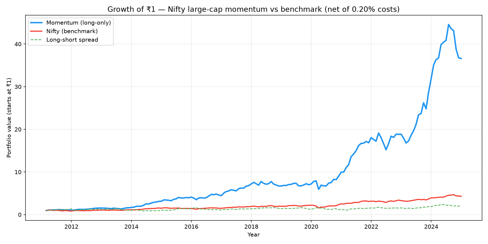
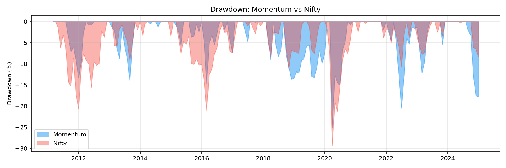
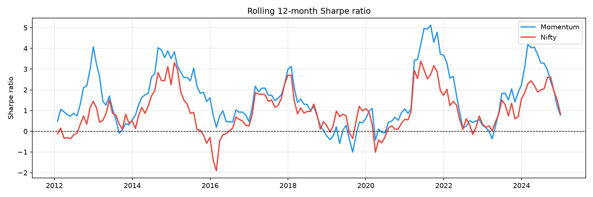
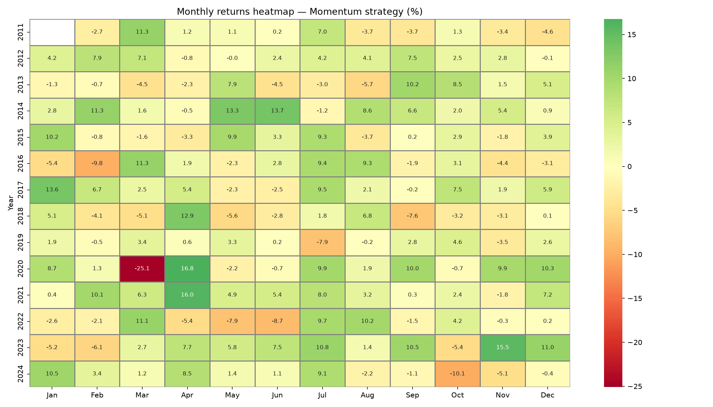
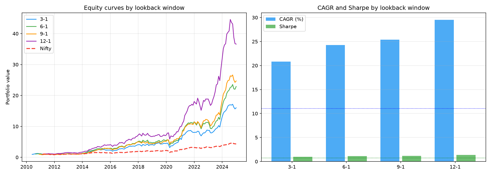
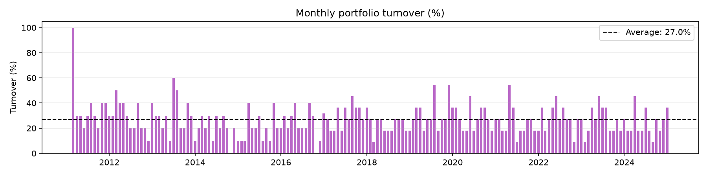

# Cross-Sectional Momentum — Nifty Large-Cap Universe

A backtested systematic equity strategy in Python.

> Survivorship bias present. Educational project only. Not investment advice.

## Hypothesis
Stocks with the highest returns over the past 12 months (excluding the most recent month) tend to outperform the following month. Buying the top decile monthly beats the Nifty on a risk-adjusted basis after costs.

## Results (2010–2025, net of 0.20% transaction costs)

| Strategy | CAGR | Sharpe | Max Drawdown | Turnover |
|---|---|---|---|---|
| Momentum long-only top decile | 31.9% | 1.42 | -22.7% | 27.2% |
| Nifty 50 benchmark | 11.0% | 0.72 | -29.3% | — |
| Long-short spread | 8.0% | 0.45 | -39.0% | 27.2% |

## Equity Curve

## Drawdown

## Rolling 12-Month Sharpe Ratio

## Monthly Returns Heatmap

## Robustness — Four Lookback Windows

## Portfolio Turnover

## Method
- Universe: 113 Nifty-listed large-cap stocks (today's list — survivorship bias present)
- Signal: 12-1 month momentum (past 12 months return, skip most recent month)
- Portfolio: Top 10% by momentum, equal weighted, monthly rebalance
- Costs: 0.20% one-way, scaled by actual turnover
- Data: Yahoo Finance via yfinance, 2010–2025

## Robustness
Strategy tested across four lookback windows (3-1, 6-1, 9-1, 12-1). Momentum outperforms the Nifty on Sharpe across all windows, suggesting the result is not parameter-specific.

## Honest Limitations
- **Survivorship bias:** universe uses today's list, not historical membership. Estimated impact: 2–5% CAGR inflation
- **Bull market tailwind:** 2020–2024 Indian equity rally inflates the 15-year number
- **Simplified costs:** flat 0.20% ignores market impact on less liquid names
- **No risk model:** no volatility scaling or sector neutrality
- **Data quality:** Yahoo Finance is not institutional grade (NSE Bhavcopy or CMIE Prowess would be better)

## How to Run
1. Install Python 3
2. Run: `pip install notebook yfinance pandas numpy matplotlib seaborn`
3. Open: `jupyter notebook momentum_backtest_v2.ipynb`
4. Run all cells top to bottom
